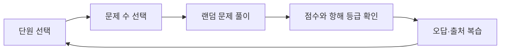
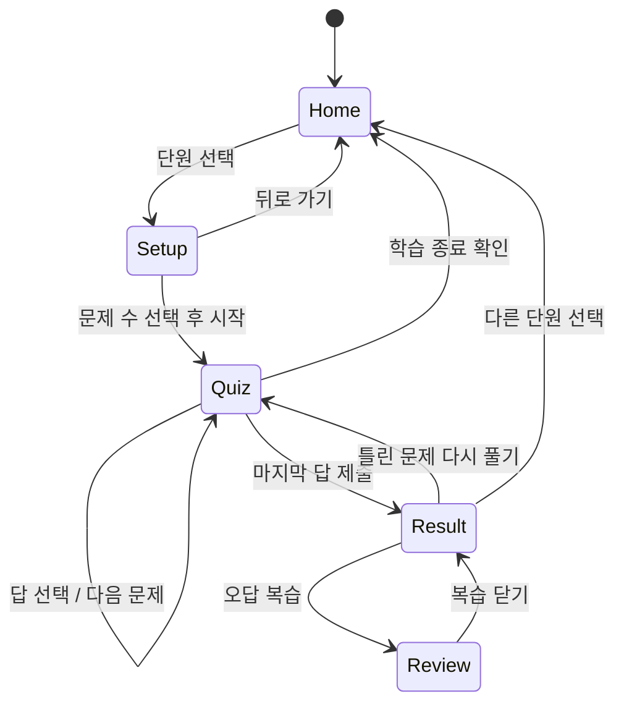

# 함정사업 획득절차 학습 웹 개발 계획서

> 가칭: **함정길잡이 — 처음 만나는 함정사업 획득절차**  
> 문서 상태: 개발 착수 가능 초안  
> 작성 기준일: 2026-09-26  
> 주요 사용자: 방위사업청 신규 직원  
> 데이터 원칙: 방위사업청 누리집에 공개된 자료만 사용

---

## 0. 개발 AI가 먼저 읽어야 할 핵심 지시

1. 이 문서의 `P0` 요구사항을 우선 구현한다. `P1`, `P2`는 P0 완료 후 진행한다.
2. MVP는 **로그인·서버·데이터베이스가 없는 정적 웹**으로 만든다.
3. 문제와 해설에 사용하는 사실은 `dapa.go.kr` 도메인의 공개 페이지 또는 공개 첨부파일에서 확인된 내용만 허용한다.
4. AI가 추론하거나 다른 사이트에서 가져온 내용을 문제의 정답 근거로 사용하지 않는다.
5. 모든 문제에는 사용자가 직접 확인할 수 있는 출처 URL과 해설을 붙인다.
6. 앱에는 검수 상태가 `verified`인 문제만 노출한다. 문제 수를 맞추기 위해 근거가 약한 문제를 만들지 않는다.
7. 내부자료, 비공개자료, 개인정보, 군사기밀, 목표 성능과 시험평가 세부계획 등 민감정보를 입력하거나 추정하지 않는다.
8. 방위사업청 공식 서비스로 오인되지 않도록 공식 로고를 임의로 사용하지 않고, 푸터에 콘테스트용 학습 프로토타입임을 표시한다.
9. 구현 중 애매한 사항은 `15. 확정 가정`을 따른다.
10. 구현 완료 후 `12. 테스트 계획`과 `14. 완료 정의`를 모두 확인한다.

우선순위 표기는 다음과 같다.

- `P0`: 이번 콘테스트 MVP에서 반드시 구현
- `P1`: 시간이 허용되면 구현하는 완성도 향상 기능
- `P2`: 후속 고도화 기능

---

## 1. 문제 정의

### 1.1 문제 상황

방위사업청의 함정사업 획득절차는 사업관리·연구개발·계약·시험평가 등 여러 개념과 단계가 연결되어 있어, 관련 업무를 처음 접한 신규 직원이 전체 흐름과 용어를 한 번에 이해하기 어렵다. 문서 중심 학습만으로는 단계의 순서와 관계를 기억하기 어렵고, 학습자가 자신이 어느 부분을 이해하지 못했는지 즉시 확인하기도 어렵다.

### 1.2 대상 사용자

- 1차 사용자: 방위사업청 신규·전입 직원
- 2차 사용자: 함정사업과 방위력개선사업의 기본 흐름을 복습하려는 직원
- 사용자 전제: 함정사업 관련 사전지식이 거의 없거나 단편적인 용어만 알고 있음

### 1.3 해결하려는 문제

- 복잡한 함정사업 획득절차를 짧은 퀴즈를 통해 부담 없이 반복 학습하게 한다.
- 함정 유형별 공개 사례를 획득절차와 연결해 추상적인 절차를 구체적으로 이해하게 한다.
- 오답 원인과 공식 출처를 즉시 확인해 잘못 기억한 내용을 스스로 교정하게 한다.

### 1.4 한 문장 가치 제안

> 신규 직원이 원하는 함정 단원과 문제 수를 선택하면, 출처가 명확한 퀴즈와 오답 해설을 통해 함정사업 획득절차를 짧고 반복적으로 익힐 수 있는 웹 학습 도구.

### 1.5 목표

- 사용자가 별도 설명 없이 30초 안에 학습 단원과 문제 수를 선택할 수 있다.
- 5문제 학습을 3분 안에 완료할 수 있다.
- 모든 문제의 정답 근거를 방위사업청 공개자료에서 확인할 수 있다.
- 사용자가 결과 화면에서 틀린 내용과 관련 획득단계를 바로 복습할 수 있다.
- 모바일과 PC에서 동일한 핵심 흐름을 사용할 수 있다.

### 1.6 목표가 아닌 것

- 인사평가, 자격 인증 또는 공식 교육 수료 판정
- 비공개 사업자료나 내부 업무시스템과의 연동
- 실시간 사업 현황, 업체 평가 또는 의사결정 지원
- 생성형 AI가 실시간으로 문제·정답을 만들어 내는 기능
- 사용자 간 경쟁을 위한 실명 순위표

---

## 2. 서비스 콘셉트

### 2.1 핵심 학습 루프



### 2.2 차별점

1. **출처가 보이는 퀴즈**: 결과 화면에서 정답 해설과 방위사업청 원문 링크를 함께 제공한다.
2. **절차가 보이는 학습**: 현재 문제가 함정 획득절차의 어느 단계와 관련되는지 시각적으로 표시한다.
3. **짧은 반복 학습**: 5·10·20문제 중 상황에 맞게 선택하고, 틀린 문제만 다시 풀 수 있다.

### 2.3 톤앤매너

- 전문적이되 신규 직원이 이해하기 쉬운 표현을 사용한다.
- 과도한 전투·게임 표현은 피하고, `항로`, `출항`, `나침반`, `항해 기록`처럼 함정 콘셉트에 맞는 차분한 비유를 사용한다.
- 정답·오답 결과를 질책하지 않고 다음 학습 행동을 제안한다.

---

## 3. 학습 단원 구성

### 3.1 MVP 단원

| ID | 화면 표시명 | 학습 초점 | 비고 |
|---|---|---|---|
| `common-process` | 함정 획득절차 한눈에 보기 | 소요제기·결정, 선행연구/개념설계, 기본설계, 상세설계·선도함 건조, 시험평가, 후속함 건조 등 전체 흐름 | 함종은 아니지만 신규 직원에게 필수이므로 첫 카드로 배치 |
| `destroyer` | 구축함 | 공개된 구축함 사업 사례와 상세설계·선도함 건조 등 절차의 연결 | 사용자 제안 단원 |
| `frigate` | 호위함 | 호위함 사업 공개사례, 함정 획득·계약 관련 기본 개념 | 사용자 제안 단원 |
| `amphibious` | 상륙함 | 상륙함의 역할과 공개사례, 함정사업 절차와의 연결 | 사용자 제안 단원 |
| `submarine` | 잠수함 | 장보고 계열 등 공개된 잠수함 사업 사례와 건조·후속군수지원 개념 | 추천 단원 1 |
| `mine-warfare` | 기뢰전함 | 기뢰탐색함·소해함, 탑재장비 개발과 함정 체계통합 개념 | 추천 단원 2 |
| `support-rescue` | 지원·구조함 | 군수지원·수상함구조 등 전투근무지원 함정의 역할과 획득사례 | 추천 단원 3 |

### 3.2 추가 단원 추천 근거

1. **잠수함**: 수상함과 다른 운용 특성을 가진 대표적인 함정 분야이며, 방위사업청에 공개된 장보고-Ⅲ 관련 사업자료가 있어 사례 기반 학습에 적합하다.
2. **기뢰전함**: 함정 자체와 기뢰탐색 음탐기·전투체계·무인체계 등 탑재장비가 어떻게 연결되는지 설명하기 좋다.
3. **지원·구조함**: 전투함 중심의 시야를 넓히고, 함정 획득이 다양한 임무와 지원체계를 포함한다는 점을 학습할 수 있다.

`함정 획득절차 한눈에 보기`는 함종 추천 3개와 별도로 반드시 제공한다. 사용자가 함종별 문제만 풀 경우 같은 절차가 반복되는 이유를 이해하기 어려울 수 있기 때문이다.

### 3.3 단원 카드에 표시할 정보

- 단원명과 한 줄 설명
- 단원을 상징하는 단순 아이콘 또는 실루엣
- 검수 완료 문제 수
- 최근 최고점 또는 `아직 학습 전`
- `학습 시작` 버튼
- 문제 수가 5개 미만이면 버튼 대신 `준비 중` 표시

### 3.4 문제 구성 목표

- 출시 최소 기준: 단원별 `verified` 문제 20개 이상
- 권장 기준: 단원별 24개 이상으로 구성해 20문제 모드에서도 회차별 변화를 제공
- 문제 유형: 객관식 4지선다만 사용
- 문제 분야 권장 비율:
  - 절차·순서: 35%
  - 기관·역할: 20%
  - 용어·개념: 20%
  - 공개 사업사례: 25%
- 난이도 권장 비율:
  - 입문: 50%
  - 기본: 35%
  - 응용: 15%

비율은 문제은행 전체의 목표이며, 한 회차에서 정확히 맞추기 위해 근거가 약한 문제를 추가하지 않는다.

---

## 4. 사용자 흐름과 화면 명세

### 4.1 전체 상태 흐름



### 4.2 화면 1 — 홈/단원 선택 (`/`)

#### 목적

서비스의 용도와 학습할 단원을 즉시 이해하고 선택하게 한다.

#### 구성

- 헤더: 서비스명 `함정길잡이`, 설명 `공개자료로 익히는 함정사업 획득절차`, `전체 절차 보기`
- 히어로 문구: `오늘은 어떤 함정의 획득 항로를 살펴볼까요?`
- 학습기록이 있으면 `최근 학습 이어보기` 보조 버튼
- 단원 카드 그리드: `common-process`를 첫 번째 강조 카드로 배치
- 푸터 문구:
  - `본 서비스는 방위사업청 공개자료를 활용한 AI 콘테스트용 학습 프로토타입입니다.`
  - `비공개·내부자료를 사용하지 않습니다.`

#### 동작

- 단원 카드를 누르면 문제 수 선택 화면으로 이동한다.
- 키보드 `Tab`과 `Enter`만으로도 모든 카드를 선택할 수 있어야 한다.
- 학습기록은 기기 로컬 저장소에만 보관한다.

### 4.3 화면 2 — 문제 수 선택 (`/setup/:unitId`)

- 선택한 단원명, 한 줄 설명, 관련 획득단계 태그
- 문제 수 선택 버튼: `5문제`, `10문제`, `20문제`
- 예상 시간: 각각 약 3분, 5분, 10분
- `문제 시작` 기본 버튼, `단원 다시 선택` 보조 버튼
- 기본 선택값은 5문제다.
- 검수 문제 수보다 큰 선택지는 비활성화하고 `검수된 문제가 더 필요합니다`라고 표시한다.
- 문제 유형은 사용자가 선택하지 않으며 문제은행에서 자동으로 섞는다.
- 시작 시 한 회차의 문제와 보기 순서를 확정한다. 새로고침해도 바뀌지 않는다.

### 4.4 화면 3 — 문제 풀이 (`/quiz`)

#### 구성

- 단원명, `3 / 10` 형식의 현재 순서, 진행률 바
- 현재 문제의 관련 획득단계 태그
- 질문과 1~4번 보기 버튼
- `다음 문제` 버튼, 마지막 문제에서는 `답안 제출`
- `학습 종료` 링크

#### 상호작용

- 보기는 하나만 선택할 수 있고 선택 전에는 다음 버튼을 비활성화한다.
- 선택 상태는 색상 외에도 테두리·체크 아이콘으로 구분한다.
- 숫자키 `1`~`4`로 보기를 고르고 `Enter`로 다음 문제로 이동할 수 있다.
- 문제 풀이 중에는 정답을 바로 보여주지 않는다. 결과 화면에서 한 번에 복습한다.
- 뒤로 가기 또는 `학습 종료` 시 `현재 진행 상황을 종료할까요?` 확인창을 표시한다.
- 새로고침 시 `sessionStorage`의 현재 회차를 복원한다.

### 4.5 화면 4 — 결과 (`/result`)

#### 필수 표시 정보

- `정답 수 / 전체 문제 수`와 100점 환산 점수
- 항해 등급과 짧은 격려 문구
- 정답·오답 수, 단원명, 완료 시각
- `오답 복습`, `다른 단원 선택`, `같은 조건으로 다시 풀기` 버튼
- `틀린 문제 다시 풀기` 버튼은 오답이 있을 때만 표시

#### 점수 계산

```text
score = round((correctCount / totalCount) * 100)
```

#### 항해 등급

| 점수 | 등급 | 안내 문구 예시 |
|---|---|---|
| 100 | 함정사업 마스터 | 모든 항로를 정확히 짚었습니다. |
| 80~99 | 출항 준비 완료 | 핵심 절차를 잘 이해했습니다. 틀린 항목만 확인해 보세요. |
| 60~79 | 항로 재점검 | 기본 흐름은 잡았습니다. 오답의 관련 단계를 다시 살펴보세요. |
| 0~59 | 기초 절차 탐색 중 | `함정 획득절차 한눈에 보기`부터 천천히 다시 시작해 보세요. |

### 4.6 화면 5 — 오답 복습 (`/result/review` 또는 결과 내부 섹션)

각 오답 카드에 다음 항목을 표시한다.

- 문제와 사용자가 고른 답
- 정답
- 2~4문장의 쉬운 해설
- 관련 획득단계
- 출처 제목, 게시일, `방위사업청 원문 보기` 링크
- `이 문제 다시 보기` 완료 체크

오답이 하나도 없으면 복습 목록 대신 축하 상태를 보여준다.

### 4.7 예외 화면

- 존재하지 않는 단원 URL: 홈으로 이동할 수 있는 404 상태
- 진행 세션 없이 `/quiz` 직접 접근: 설정 화면으로 리다이렉트
- 결과 데이터 없이 `/result` 직접 접근: 홈으로 리다이렉트
- 데이터 로드 실패: `문제 데이터를 불러오지 못했습니다`와 재시도 버튼 표시
- 검수 문제 부족: 가능한 문제 수만 활성화하고 이유를 명확히 표시

---

## 5. 기능 요구사항

| ID | 우선순위 | 요구사항 | 완료 기준 |
|---|---|---|---|
| FR-001 | P0 | 홈에서 학습 단원을 선택할 수 있다. | 7개 단원이 정의되고 준비된 단원은 설정 화면으로 이동한다. |
| FR-002 | P0 | 5·10·20문제 중 하나를 고를 수 있다. | 기본값은 5이며 부족한 선택지는 이유와 함께 비활성화된다. |
| FR-003 | P0 | 중복 없는 문제를 무작위로 출제한다. | 같은 회차 내 문제 ID가 중복되지 않는다. |
| FR-004 | P0 | 각 문제는 1~4번 객관식이다. | 보기는 항상 4개이며 한 번에 하나만 선택 가능하다. |
| FR-005 | P0 | 마지막 제출 후 자동 채점한다. | 정답 수와 환산 점수가 정확히 표시된다. |
| FR-006 | P0 | 오답과 공식 출처를 복습할 수 있다. | 모든 노출 문제에 해설과 `dapa.go.kr` 출처가 있다. |
| FR-007 | P0 | 결과에서 홈으로 돌아갈 수 있다. | `다른 단원 선택`이 홈으로 이동하고 회차를 종료한다. |
| FR-008 | P0 | 진행 중 새로고침을 복구한다. | 같은 문제·보기·답안·위치가 복원된다. |
| FR-009 | P0 | 검수 문제만 노출한다. | `status !== verified`는 출제에서 제외된다. |
| FR-010 | P1 | 틀린 문제만 다시 풀 수 있다. | 오답 ID로 새 회차가 생성된다. |
| FR-011 | P1 | 최근 최고점과 학습일을 보여준다. | 익명 학습 요약만 로컬 저장하고 홈 카드에 표시한다. |
| FR-012 | P1 | 전체 획득절차 요약을 볼 수 있다. | 단계 설명과 공개 출처가 있는 반응형 절차 맵을 제공한다. |
| FR-013 | P2 | 상황형 미션 문제를 제공한다. | 공개자료만으로 판단 가능한 상황형 문제를 별도 태그로 제공한다. |

---

## 6. 보완 기능 후보

### 6.1 기능적 보완 후보 3개

| 후보 | 사용자 가치 | 난이도 | 권장 우선순위 |
|---|---|---:|---|
| 오답노트 + 공식 출처 확인 | 점수 확인에서 끝나지 않고 틀린 이유를 바로 학습한다. | 중 | **P0 채택** |
| `1분 핵심정리` 절차 맵 | 퀴즈 전에 큰 그림을 익혀 무작정 암기하는 문제를 줄인다. | 중 | **P1 채택** |
| 개인 학습기록·취약영역 표시 | 단원별 최고점과 자주 틀리는 단계에 따라 재학습을 제안한다. | 중 | **P1 채택** |

### 6.2 사용감 보완 후보 3개

| 후보 | 사용자 가치 | 난이도 | 권장 우선순위 |
|---|---|---:|---|
| 진행률 바 + 현재 획득단계 태그 | 남은 분량과 학습 맥락을 동시에 파악한다. | 하 | **P0 채택** |
| 새로고침 자동복구 + 이어하기 | 실수로 페이지를 닫아도 처음부터 다시 하지 않는다. | 중 | **P0 채택** |
| 반응형·키보드·색약 친화 UI | 다양한 기기와 사용 환경에서 불편 없이 접근한다. | 중 | **P0 채택** |

### 6.3 재미 보완 후보 3개

| 후보 | 사용자 가치 | 난이도 | 권장 우선순위 |
|---|---|---:|---|
| 점수별 항해 등급·배지 | 결과에 성취감을 주되 과도한 경쟁은 피한다. | 하 | **P0 등급 / P1 배지** |
| 연속 정답 `순항` 표시 | 풀이 중 집중과 리듬을 높인다. | 하 | P2 |
| 업무 맥락을 단순화한 상황형 미션 | 단순 암기에서 절차 적용 학습으로 확장한다. | 상 | P2 |

### 6.4 최종 채택 조합

MVP에서는 `오답노트·공식 출처`, `진행률·획득단계`, `자동복구`, `접근성`, `항해 등급`을 구현한다. 핵심정리 절차 맵과 개인 학습기록은 P1으로 두되, 일정이 허용되면 콘테스트 시연 완성도를 위해 우선 추가한다.

---

## 7. 문제 데이터 설계

### 7.1 데이터 구조

```ts
type UnitId =
  | "common-process"
  | "destroyer"
  | "frigate"
  | "amphibious"
  | "submarine"
  | "mine-warfare"
  | "support-rescue";

type AcquisitionStage =
  | "requirement"
  | "decision"
  | "preliminary-research"
  | "concept-design"
  | "basic-design"
  | "detailed-design"
  | "lead-ship-construction"
  | "test-evaluation"
  | "follow-on-construction"
  | "contract"
  | "integrated-logistics-support"
  | "general";

type Source = {
  id: string;
  title: string;
  url: string;
  publisher: "방위사업청";
  publishedAt?: string;
  accessedAt: string;
  locator?: string;
};

type Question = {
  id: string;
  unitId: UnitId;
  stage: AcquisitionStage;
  category: "procedure" | "role" | "term" | "case";
  difficulty: "intro" | "basic" | "applied";
  prompt: string;
  options: [string, string, string, string];
  answerIndex: 0 | 1 | 2 | 3;
  explanation: string;
  sourceIds: string[];
  status: "draft" | "verified" | "retired";
  verifiedAt?: string;
  reviewedBy?: string;
};

type Unit = {
  id: UnitId;
  title: string;
  summary: string;
  icon: string;
  stages: AcquisitionStage[];
  order: number;
};
```

### 7.2 ID 규칙

- 출처: `src-dapa-0001`
- 문제: `q-{unitId}-{4자리 일련번호}`
- ID는 한 번 배포한 후 재사용하지 않는다.
- 잘못된 문제는 삭제보다 `retired` 처리해 학습기록 참조가 깨지지 않게 한다.

### 7.3 문제 작성 규칙

1. 질문 하나에서는 하나의 지식만 평가한다.
2. 질문 본문만 읽고 무엇을 묻는지 이해할 수 있어야 한다.
3. 보기는 모두 문법적으로 자연스럽고 같은 범주의 표현이어야 한다.
4. `모두 정답`, `정답 없음`, 부정문 중첩은 사용하지 않는다.
5. `옳지 않은 것`을 묻는 경우 부정 표현을 강조하되 긍정형 질문을 우선한다.
6. 오답 보기는 그럴듯하지만 공식 근거상 명확히 틀려야 한다.
7. 인명·조직명·금액·일정은 가급적 핵심 문제로 쓰지 않는다. 사용 시 기준일을 명시한다.
8. 해설은 정답의 이유와 혼동하기 쉬운 오답과의 차이를 설명한다.
9. 약어는 최초 등장 시 한글 설명을 함께 쓴다.
10. 원문을 길게 복사하지 않고 사실을 쉬운 말로 재서술한다.

### 7.4 출처·검수 규칙

- 허용 도메인: `https://www.dapa.go.kr/`, `https://dapa.go.kr/`의 공개 페이지와 첨부파일
- 앱 실행 중 외부 페이지를 크롤링하지 않는다. 검수 완료 데이터를 빌드에 포함한다.
- 생성형 AI는 초안을 작성할 수 있으나 `draft`로만 저장한다.
- 사람이 원문과 정답을 대조한 뒤에만 `verified`로 변경한다.
- 원문이 삭제되거나 내용이 바뀌면 재검수하거나 `retired` 처리한다.
- 동일 사실을 표현만 바꿔 여러 문제로 반복하지 않는다.
- 공개 여부가 불명확하면 사용하지 않는다.
- 비공개 대상정보에 해당할 수 있는 세부 성능, 협상전략, 시험평가 세부사항 등은 문제 소재로 확대·추정하지 않는다.

### 7.5 빌드 전 데이터 검증

`npm run validate:data`로 다음을 검사한다.

- 문제 ID 유일성
- 보기 개수가 정확히 4개인지와 중복 보기 여부
- `answerIndex` 범위
- 빈 질문·보기·해설 존재 여부
- 존재하지 않는 `unitId`, `sourceId`, `stage` 참조
- `verified` 문제의 출처 누락 여부
- 출처 URL의 허용 도메인 여부
- 단원별 검수 문제 수와 5·10·20문제 제공 가능 여부

URL 실제 응답 확인은 네트워크 문제로 빌드가 실패하지 않게 별도 유지보수 명령으로 분리한다.

### 7.6 랜덤 출제 규칙

1. 선택 단원과 `verified` 상태로 문제를 필터링한다.
2. 요청 수보다 데이터가 적으면 시작하지 않는다.
3. Fisher–Yates 방식으로 섞고 필요한 개수를 선택한다.
4. 각 문제의 보기 순서를 다시 섞고 `answerIndex`를 재계산한다.
5. 한 회차에서 같은 문제를 중복 출제하지 않는다.
6. 세션 생성 후 문제·보기 순서를 고정한다.
7. 가능하면 정답 번호 분포의 최대·최소 차이가 2를 넘지 않게 보정한다.

---

## 8. 공개자료 시작 목록

아래 자료는 문제은행 구축의 **시작점**이며, 각 문제는 실제 원문을 다시 확인한 뒤 등록한다. 접근 기준일은 2026-09-26이다.

| 활용 영역 | 방위사업청 공개자료 | 활용 예시 |
|---|---|---|
| 공통 사업관리 | [사업관리](https://www.dapa.go.kr/dapa/page/selectPage.do?menuSeq=3209&pageSeq=3195) | 소요제기·결정, 선행연구, 사업추진기본전략, 연구개발과 IPT의 역할 |
| 함정 연구개발 흐름 | [연구개발사업 절차도 PDF](https://www.dapa.go.kr/dapa/files/02/2.%EC%97%B0%EA%B5%AC%EA%B0%9C%EB%B0%9C%EC%82%AC%EC%97%85%EC%A0%88%EC%B0%A8%EB%8F%84.pdf) | 선행연구(개념설계), 기본설계, 상세설계·선도함 건조, 시험평가, 후속함 건조 |
| 계약 | [계약관리](https://www.dapa.go.kr/dapa/page/selectPage.do?menuSeq=3077&pageSeq=3197) | 조달과 계약관리의 목적·기본 흐름 |
| 구축함 | [한국형구축함(KDDX) 상세설계 및 선도함건조 본격 착수](https://www.dapa.go.kr/dapa/doc/selectDoc.do?bbsSeq=326&currentPageNo=1&docSeq=58937&menuSeq=3069&recordCountPerPage=10) | 기본설계 결과의 구체화, 선도함 건조와 시험평가의 연결 |
| 호위함 | [필리핀 바다 지키는 K-호위함, 호위함 2차 사업 수주](https://www.dapa.go.kr/dapa/doc/selectDoc.do?bbsSeq=326&currentPageNo=1&docSeq=57960&menuSeq=3069&recordCountPerPage=10) | 수출계약 사례임을 명시하고 국내 획득절차와 혼동하지 않게 사용 |
| 잠수함 | [우리 손으로 만든 명품 잠수함 세계 최고를 향해 나아간다](https://www.dapa.go.kr/dapa/doc/selectDoc.do?bbsSeq=326&docSeq=18765&menuSeq=3069) | 장보고-Ⅲ 공개 사례, 건조 착수와 후속군수지원 |
| 기뢰전함 | [소해함의 두뇌, 국내기술로 개발합니다](https://www.dapa.go.kr/dapa/doc/selectDoc.do?bbsSeq=326&docSeq=20269&menuSeq=3069) | 기뢰전 전투체계, 탑재장비 통합, 기뢰대항작전 |
| 기뢰전함 | [차기 소해함(MSH-II) 기본설계 착수](https://www.dapa.go.kr/dapa/doc/selectDoc.do?bbsSeq=326&docSeq=16385&menuSeq=3069) | 기본설계, 상세설계·건조, 전력화의 공개 흐름 |
| 상륙·지원·구조함 | [다양한 함정 작전상황, 이제 한눈에 들어옵니다](https://www.dapa.go.kr/dapa/doc/selectDoc.do?bbsSeq=326&docSeq=21692&menuSeq=3069) | 공개된 대상 함정 유형과 탑재장비 성능개선 사례 |
| 보안 경계 | [비공개대상정보 세부기준](https://www.dapa.go.kr/dapa/page/selectPage.do?menuSeq=3215&pageSeq=3222) | 문제 데이터에 포함하면 안 되는 정보 범위 점검 |

자료 수가 부족한 단원은 방위사업청 누리집의 보도자료·정책자료·공개 첨부파일에서 추가 조사한다. 다른 기관이나 언론 자료로 문제 수를 채우지 않는다.

---

## 9. 기술 설계

### 9.1 권장 기술 스택

- 프론트엔드: React + TypeScript + Vite
- 스타일: Tailwind CSS
- 라우팅: React Router
- 데이터 검증: Zod
- 아이콘: Lucide React 또는 직접 제작한 단순 SVG
- 단위/컴포넌트 테스트: Vitest + React Testing Library
- E2E 테스트: Playwright
- 패키지 관리자: npm
- 배포 형태: 정적 파일 배포

구현 시점의 안정화된 최신 버전을 사용하고 `package-lock.json`을 커밋한다. 프로젝트에 이미 표준 스택이 있다면 기존 스택을 우선하되, 이 문서의 기능·보안·테스트 요구사항은 유지한다.

### 9.2 서버를 두지 않는 이유

- 로그인과 개인별 서버 저장이 MVP 목표에 포함되지 않는다.
- 문제 데이터는 검수된 정적 콘텐츠이므로 런타임 API가 필요하지 않다.
- 네트워크가 제한된 시연 환경에서도 안정적으로 동작할 수 있다.
- 공격 표면과 운영 복잡도를 줄일 수 있다.

### 9.3 권장 디렉터리 구조

```text
src/
  app/
    App.tsx
    router.tsx
  components/
    layout/
    quiz/
    result/
    ui/
  data/
    units.ts
    questions/
      common-process.ts
      destroyer.ts
      frigate.ts
      amphibious.ts
      submarine.ts
      mine-warfare.ts
      support-rescue.ts
    sources.ts
  domain/
    quiz.ts
    scoring.ts
    types.ts
    validation.ts
  pages/
    HomePage.tsx
    SetupPage.tsx
    QuizPage.tsx
    ResultPage.tsx
    ReviewPage.tsx
  storage/
    quizSession.ts
    learningHistory.ts
  styles/
  test/
scripts/
  validate-question-data.ts
```

### 9.4 상태 모델

```ts
type QuizSession = {
  version: 1;
  id: string;
  unitId: UnitId;
  questionIds: string[];
  renderedOptions: Record<string, string[]>;
  renderedAnswerIndexes: Record<string, number>;
  answers: Record<string, number>;
  currentIndex: number;
  startedAt: string;
  completedAt?: string;
};
```

- 진행 세션: `sessionStorage`
- 최근 최고점·최근 학습일: `localStorage`
- 이름, 사번, 소속 등 개인 식별정보는 저장하지 않는다.
- 데이터 구조 변경에 대비해 `version`을 포함하고, 지원하지 않는 버전은 안전하게 초기화한다.

### 9.5 핵심 도메인 함수

UI와 분리된 순수 함수로 구현하고 단위 테스트한다.

```ts
createQuizSession(unitId, count, questions): QuizSession
selectQuestions(questions, count): Question[]
shuffleQuestionOptions(question): RenderedQuestion
gradeSession(session, questionMap): QuizResult
getScoreGrade(score): ScoreGrade
getAvailableCounts(unitId, questions): Array<5 | 10 | 20>
```

### 9.6 API

MVP에는 외부 API와 자체 백엔드 API가 없다. 방위사업청 원문 링크는 결과 화면에서 사용자가 직접 새 탭으로 열 때만 접근한다. 향후 관리자용 문제 편집 기능이 필요하면 별도 시스템으로 설계하고 본 정적 앱과 분리한다.

---

## 10. UI·비주얼 가이드

### 10.1 디자인 방향

- 키워드: `신뢰`, `정돈`, `해양`, `항로`, `학습`
- 전체 인상: 공공기관 업무도구의 신뢰감 + 교육 서비스의 친근함
- 배경에 낮은 대비의 등심선, 항로 점선, 레이더 원형 패턴을 제한적으로 사용
- 함정 사진은 저작권과 보안 검토 부담이 있으므로 자체 제작한 추상 실루엣·아이콘을 우선 사용
- 공식 로고나 공식 서비스처럼 보이는 헤더는 승인 없이 사용하지 않음

### 10.2 색상 토큰 예시

```css
--navy-950: #071b2c;
--navy-800: #123a56;
--ocean-600: #087ea4;
--ocean-400: #38b9d6;
--sky-100: #eaf7fb;
--signal-500: #f2a93b;
--success-600: #16835d;
--danger-600: #c44545;
--surface: #ffffff;
--text: #10212b;
```

색상은 예시이며 WCAG AA 대비 기준을 충족하도록 조정한다. 정답·오답·선택 상태는 색상만으로 표현하지 않는다.

### 10.3 반응형 기준

- 모바일: 360px 이상, 카드 1열, 보기 버튼 전체 너비
- 태블릿: 768px 이상, 카드 2열
- 데스크톱: 1024px 이상, 카드 3열, 본문 최대 너비 약 960px
- 퀴즈 질문의 읽기 폭은 과도하게 넓어지지 않게 제한

### 10.4 접근성

- 의미 있는 HTML 요소와 명확한 제목 계층 사용
- 모든 상호작용 요소에 키보드 포커스 표시
- 버튼 터치 영역 최소 44×44px
- 보기 그룹에 `fieldset`과 `legend` 또는 동등한 구조 적용
- 진행률에 화면낭독기용 현재값 제공
- 문제 이동 시 질문 제목으로 포커스 이동
- `prefers-reduced-motion` 설정 존중
- 원문 링크에는 새 창 열림을 안내

---

## 11. 보안·개인정보·콘텐츠 안전

### 11.1 기본 원칙

- 공개된 방위사업청 자료만 사용한다.
- 내부 업무자료를 붙여 넣는 입력창, 파일 업로드, 자유 서술형 AI 질문 기능을 MVP에 만들지 않는다.
- 사용자 계정과 개인정보를 수집하지 않는다.
- 외부 분석·광고·추적 스크립트를 넣지 않는다.
- API 키나 비밀값이 필요한 기능을 넣지 않는다.
- 앱은 런타임에 방위사업청 사이트를 자동 수집하지 않는다.

### 11.2 프론트엔드 보안 기준

- 사용자 또는 데이터의 HTML을 `dangerouslySetInnerHTML`로 렌더링하지 않는다.
- 출처 URL은 빌드 검증 단계에서 허용 도메인을 확인한다.
- 외부 링크에 `target="_blank"` 사용 시 `rel="noopener noreferrer"`를 함께 사용한다.
- 운영 배포 시 가능한 범위에서 CSP, `X-Content-Type-Options`, `Referrer-Policy` 등 보안 헤더를 설정한다.
- 의존성 수를 최소화하고 락파일과 의존성 취약점 점검 결과를 확인한다.
- 시스템 폰트 또는 번들된 자산을 사용해 런타임 외부 호출을 최소화한다.

### 11.3 콘텐츠 안전 체크리스트

- [ ] 출처가 방위사업청 공개 URL인가?
- [ ] 현재 별도 인증이나 신원확인 없이 열람 가능한가?
- [ ] 정답이 원문에 직접 근거하는가?
- [ ] 비공개 정보나 세부 성능을 추정하지 않았는가?
- [ ] 진행 중 사업의 협상·평가·의사결정 내용을 확대 해석하지 않았는가?
- [ ] 날짜에 따라 바뀌는 내용에는 기준 시점을 표시했는가?
- [ ] 다른 기관·업체·언론의 설명을 정답 근거로 섞지 않았는가?
- [ ] 검수자와 검수일을 기록했는가?

---

## 12. 테스트 계획

### 12.1 단위 테스트

- 요청 수만큼 중복 없이 문제를 선택한다.
- 5·10·20문제의 점수를 올바르게 계산한다.
- 보기 순서를 바꾼 후에도 정답 인덱스가 정확하다.
- `verified`가 아닌 문제는 출제하지 않는다.
- 문제 수가 부족하면 해당 선택지가 비활성화된다.
- 점수 경계값 0, 59, 60, 79, 80, 99, 100에서 등급이 정확하다.
- 잘못된 로컬 저장 데이터가 있어도 앱이 중단되지 않고 초기화된다.

### 12.2 컴포넌트 테스트

- 보기를 고르기 전 다음 버튼이 비활성화된다.
- 보기 하나를 선택하면 다른 보기는 선택 해제된다.
- 마지막 문제에서 버튼 문구가 `답안 제출`로 바뀐다.
- 오답 카드에 사용자 답, 정답, 해설, 출처가 표시된다.
- 키보드로 단원·문제·버튼을 조작할 수 있다.

### 12.3 E2E 핵심 시나리오

1. 홈에서 구축함 선택 → 5문제 선택 → 전부 풀이 → 결과 확인 → 홈 복귀
2. 10문제 진행 중 새로고침 → 같은 위치와 답안으로 복구
3. 일부 오답 제출 → 오답 복습 → 원문 링크 확인 → 틀린 문제 다시 풀기
4. `/quiz` 직접 접근 → 안전하게 설정 또는 홈으로 이동
5. 모바일 화면에서 카드·보기·결과가 가로 스크롤 없이 표시

### 12.4 품질 목표

- Lighthouse Performance 90 이상을 목표
- Lighthouse Accessibility 90 이상, 가능하면 100
- 초기 주요 콘텐츠가 일반적인 내부망/로컬 환경에서 2초 이내 표시
- 콘솔 오류 0건
- 데이터 검증 오류 0건
- P0 E2E 시나리오 전부 통과

---

## 13. 구현 순서

### 단계 1 — 프로젝트 기반

- Vite React TypeScript 프로젝트 초기화
- Tailwind, 라우터, 테스트 환경 설정
- 전역 색상·타이포그래피·레이아웃 적용
- 핵심 데이터 타입 정의

**산출물:** 앱이 실행되고 홈·설정·퀴즈·결과 빈 화면으로 이동 가능

### 단계 2 — 데이터 계층과 검증

- 단원·출처·문제 파일 구조 생성
- Zod 스키마와 `validate:data` 스크립트 구현
- 소량의 `verified` 샘플로 검증 흐름 확인
- 문제 선택과 보기 섞기 로직 및 단위 테스트

**산출물:** 잘못된 문제 데이터가 빌드 전에 탐지됨

### 단계 3 — 핵심 퀴즈 흐름

- 단원 카드와 문제 수 선택
- 세션 생성·저장·복구
- 4지선다 풀이, 진행률, 키보드 조작
- 제출과 채점

**산출물:** 5·10·20문제 전체 흐름이 동작함

### 단계 4 — 결과와 학습 피드백

- 점수·항해 등급
- 오답 복습과 공식 출처 링크
- 틀린 문제 재도전
- 홈 복귀와 같은 조건 재도전

**산출물:** 사용자가 점수뿐 아니라 틀린 이유까지 확인 가능

### 단계 5 — 전체 콘텐츠 구축

- 단원별 방위사업청 공개자료 조사
- 문제 초안 작성 → 원문 대조 → 검수 상태 변경
- 단원별 최소 20개, 권장 24개 확보
- 유사·중복 문제 제거와 문장 난이도 조정

**산출물:** 모든 단원에서 20문제 모드 사용 가능, 각 문제의 출처 추적 가능

### 단계 6 — 완성도와 검증

- 반응형·접근성·빈 상태·오류 상태 보완
- P1 절차 맵과 학습기록을 일정에 따라 추가
- 단위·컴포넌트·E2E 테스트 실행
- 실제 시연 기기와 배포 환경에서 최종 점검

**산출물:** `14. 완료 정의` 충족

---

## 14. 완료 정의(Definition of Done)

- [ ] 홈에 공통 절차와 6개 함종 단원이 표시된다.
- [ ] 사용자가 단원과 5·10·20문제를 선택할 수 있다.
- [ ] 각 문제는 4지선다이며 같은 회차에 중복 출제되지 않는다.
- [ ] 새로고침 후에도 진행 중 회차가 복구된다.
- [ ] 제출 즉시 점수와 등급이 정확히 계산된다.
- [ ] 결과에서 오답·해설·관련 단계·방위사업청 출처를 확인할 수 있다.
- [ ] 홈 복귀, 같은 조건 재도전, 오답 재도전이 정상 동작한다.
- [ ] 검수되지 않은 문제는 앱에 노출되지 않는다.
- [ ] 모든 노출 문제에 유효한 방위사업청 공개 출처가 있다.
- [ ] 단원별 최소 20개의 검수 문제가 있다.
- [ ] 개인정보, 내부자료, 비공개자료를 입력·수집·노출하는 기능이 없다.
- [ ] 모바일 360px과 데스크톱에서 레이아웃이 정상이다.
- [ ] 키보드만으로 핵심 학습 흐름을 완료할 수 있다.
- [ ] 데이터 검증, 단위 테스트, 핵심 E2E 테스트가 통과한다.
- [ ] 콘솔 오류가 없다.
- [ ] 푸터에 콘테스트용 프로토타입과 공개자료 사용 원칙이 표시된다.
- [ ] README에 실행·테스트·데이터 추가·배포 방법이 정리되어 있다.

---

## 15. 확정 가정과 의사결정

별도 지시가 없으면 다음을 확정사항으로 취급한다.

1. 한국어 단일 언어로 개발한다.
2. 로그인과 사용자 계정은 만들지 않는다.
3. 서버와 데이터베이스 없이 정적 앱으로 개발한다.
4. 학습기록은 현재 브라우저에만 익명으로 저장한다.
5. 실시간 AI 문제 생성과 챗봇은 만들지 않는다.
6. 점수는 공식 평가나 수료 증빙으로 사용하지 않는다.
7. 풀이 중 정답을 공개하지 않고 결과에서 한 번에 복습한다.
8. 공식 로고와 함정 실사진은 별도 승인·권리 확인 전까지 사용하지 않는다.
9. 문제 데이터 품질이 기능 수보다 우선이다. 문제 수가 부족하면 선택지를 비활성화한다.
10. P0 완료 전에는 순위표, 소셜 공유, 관리자 페이지 등 범위 밖 기능을 추가하지 않는다.

---

## 16. Git 작업 및 PR 규칙

저장소의 `AGENTS.md` 지침을 우선 적용한다. 개발은 `기능 브랜치 생성 → 기능 단위 커밋 → 원격 푸시 → PR 생성` 순서로 진행한다.

권장 브랜치:

```text
feat/ship-acquisition-learning-web
```

권장 커밋:

```text
feat: 프로젝트 기반 구조와 학습 단원 구현
feat: 퀴즈 진행 및 채점 기능 구현
feat: 출처 기반 문제 데이터와 오답 해설 추가
design: 함정 콘셉트 반응형 UI 적용
test: 퀴즈 핵심 흐름 테스트 추가
docs: 실행 및 문제 데이터 관리 방법 작성
```

PR 제목:

```text
[Feature] 함정사업 획득절차 학습 웹 구현
```

PR 본문에는 다음을 반드시 포함한다.

- 기존에 어떤 학습 문제가 있었는지
- 이번 변경으로 무엇이 해결되었는지
- 사용자가 어떤 순서로 서비스를 이용하는지
- 공개자료 출처와 검수 방식
- 테스트 방법과 결과
- 남은 한계 또는 후속 작업

---

## 17. README에 포함할 실행 명령

```bash
npm install
npm run dev
npm run validate:data
npm run test
npm run test:e2e
npm run build
npm run preview
```

README에는 새 문제를 추가하는 절차도 설명한다.

1. 방위사업청 공개 원문 확인
2. `sources.ts`에 출처 등록
3. 해당 단원 파일에 `draft` 문제 추가
4. 원문과 정답·해설 대조
5. 검수자와 날짜 기록 후 `verified` 변경
6. `npm run validate:data`와 테스트 실행

---

## 18. 최종 산출물과 데모

### 최종 산출물

- 실행 가능한 반응형 정적 웹 앱
- 출처·검수정보를 포함한 문제은행
- 데이터 검증 스크립트
- 단위·컴포넌트·E2E 테스트
- 실행·배포·문제 추가 방법을 설명한 README
- 콘테스트 시연용 3분 내외 데모 시나리오

### 권장 데모 시나리오

1. 홈의 `함정 획득절차 한눈에 보기` 카드로 서비스 목적 설명
2. `구축함` 단원과 5문제 선택
3. 진행률·획득단계 태그를 보여주며 2~3문제 풀이
4. 결과 점수와 항해 등급 확인
5. 오답 해설과 방위사업청 원문 링크로 신뢰성 강조
6. 새로고침 복구와 다른 단원 카드로 확장성 설명

